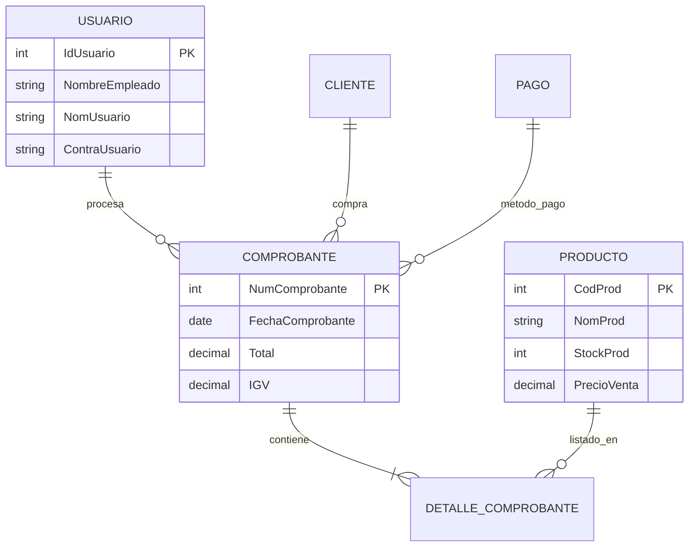

# 🛠️ Ferretería Yerias - Sistema de Gestión de Ferretería


---

### 🔗 Enlaces Rápidos
- **🇺🇸 English Version**: [README.md](./README.md)
- **🔗 Ver Código en GitHub**: [Link del Repositorio](https://github.com/dariverap/WindowsForm-System-Sales)

---

## 📖 Introducción

**Ferretería Yerias** es un sistema integral de **Punto de Venta (POS) de Escritorio** y gestión de inventarios diseñado específicamente para ferreterías. Construido con **C# Windows Forms** y **Entity Framework**, agiliza las operaciones diarias que van desde el control de stock hasta el procesamiento de ventas y reportes financieros.

Esta aplicación resuelve el problema del seguimiento manual de inventario y los procesos de pago lentos, asegurando la integridad de los datos a través de una base de datos relacional y proporcionando información en tiempo real sobre el rendimiento de las ventas.

> **Creado por Diego Rivera**

---

## 🏗️ Arquitectura

El proyecto sigue un enfoque **Database-First** (Base de Datos Primero) utilizando Entity Framework, integrado directamente en una aplicación Windows Forms.

### 📂 Estructura del Proyecto

```bash
FerreteriaYerias/
├── 📄 App.config              # Cadenas de conexión y configuración
├── 📄 Program.cs              # Punto de entrada (Inicia frmLogin)
├── 📦 Capa de Acceso a Datos (EF)
│   ├── BD.edmx                # Mapeo XML de la Base de Datos
│   ├── BD.Context.cs          # Definición del DbContext
│   └── *.cs (Entidades)       # Clases POCO (CLIENTE, PRODUCTO, etc.)
├── 🖥️ Interfaz de Usuario (Forms)
│   ├── frmLogin.cs            # Lógica de Autenticación
│   ├── frmPrincipal.cs        # Dashboard Principal (Contenedor MDI)
│   ├── frmVenta.cs            # Lógica Core del POS (Manejo de transacciones)
│   ├── frmProductos.cs        # CRUD de Inventario
│   ├── frmReporteVentas.cs    # Reportes con filtros de fecha
│   └── frmBusqueda*.cs        # Modales de búsqueda (Clientes/Productos)
└── 🛠️ Servicios/Lógica
    └── (Embebido en Forms)    # La lógica de negocio está acoplada a los eventos de UI
```

### 📊 Esquema de Base de Datos (Mermaid)

El sistema se basa en una base de datos relacional SQL Server modelada a través de Entity Framework.



---

## 💻 Stack Tecnológico

*   **Lenguaje:** C#
*   **Runtime:** .NET Framework 4.7.2
*   **Framework GUI:** Windows Forms (WinForms)
*   **ORM:** Entity Framework 6.4.4 (DB First)
*   **Base de Datos:** Microsoft SQL Server
*   **Librerías Externas:**
    *   `FontAwesome.Sharp` (Para iconografía moderna en UI)

---

## 🔑 Funcionalidades Clave y Lógica

Aunque es una aplicación de escritorio sin una API REST, la lógica de negocio central reside en la interacción entre los formularios y el `DbContext`.

### 1. Lógica de Gestión de Stock
Cuando se finaliza una venta en `frmVenta.cs`, el sistema decrementa automáticamente el inventario.

```csharp
// Fragmento de frmVenta.cs
public void actualizarStock()
{
    using (FerreteriaEntities1 bdP = new FerreteriaEntities1())
    {
        PRODUCTO estruP = new PRODUCTO();
        estruP.CodProd = Convert.ToInt32(txtProductoCodigo.Text);
        // Lógica para restar la cantidad vendida del stock actual
        estruP.StockProd = Convert.ToInt32(txtStock.Text) - Convert.ToInt32(txtCantidad.Text);
        // ... (Actualización de estado)
        bdP.Entry(estruP).State = System.Data.Entity.EntityState.Modified;
        bdP.SaveChanges();
    }
}
```

### 2. Reportes
El formulario `frmReporteVentas.cs` utiliza un Procedimiento Almacenado (`rango_fecha`) mapeado en EF para recuperar ventas dentro de fechas específicas.

---

## 🚀 Instalación y Configuración

1.  **Prerrequisitos:**
    *   Visual Studio 2019/2022.
    *   SQL Server (LocalDB o Express).
    *   .NET Framework 4.7.2 SDK.

2.  **Configuración de Base de Datos:**
    *   El proyecto espera una base de datos SQL Server llamada `Ferreteria`.
    *   Restaura la base de datos si tienes el script SQL o el archivo `.bak`.

3.  **Configuración de Conexión:**
    *   Abre el archivo `App.config`.
    *   Actualiza la sección `connectionStrings` para apuntar a tu instancia local de SQL Server:
        ```xml
        <connectionStrings>
            <add name="FerreteriaEntities1" connectionString="metadata=res://*/BD.csdl...;provider connection string=&quot;data source=NOMBRE_DE_TU_SERVER;initial catalog=Ferreteria;integrated security=True;...&quot;" providerName="System.Data.EntityClient" />
        </connectionStrings>
        ```

4.  **Compilación y Ejecución:**
    *   Abre `FerreteriaYerias.sln` en Visual Studio.
    *   Restaura los paquetes NuGet (Entity Framework, FontAwesome).
    *   Compila la solución (`Ctrl + Shift + B`).
    *   Inicia la aplicación (`F5`).

---

<p align="center">
  <sub>Creado por Diego Rivera</sub>
</p>
