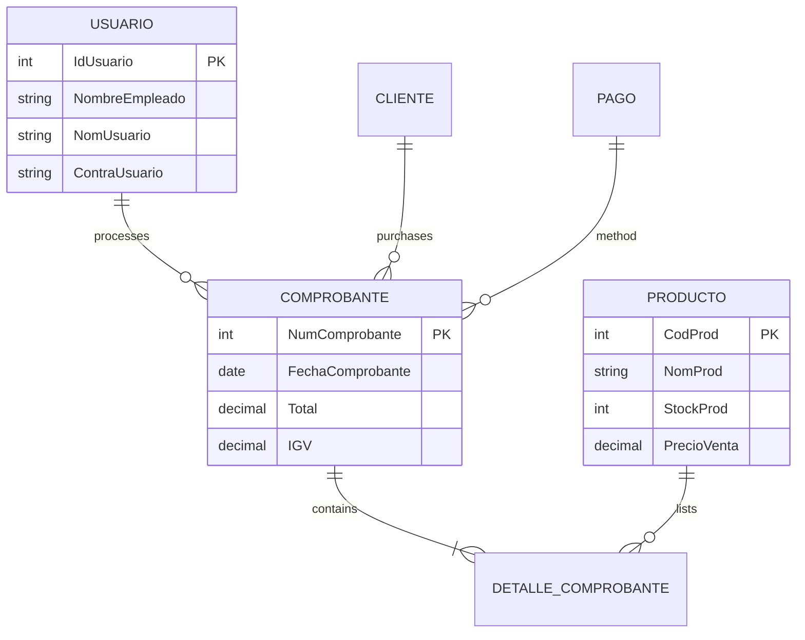

# 🛠️ Ferretería Yerias - Hardware Store Management System


---

### 🔗 Quick Links
- **🇪🇸 Versión en Español**: [README.es.md](./README.es.md)
- **🔗 View Code on GitHub**: [Repository Link](https://github.com/dariverap/WindowsForm-System-Sales)

---

## 📖 Introduction

**Ferretería Yerias** is a comprehensive **Desktop Point of Sale (POS)** and inventory management system designed specifically for hardware retail businesses. Built with **C# Windows Forms** and **Entity Framework**, it streamlines daily operations ranging from stock control to sales processing and financial reporting.

This application solves the problem of manual inventory tracking and slow checkout processes, ensuring data integrity through a relational database and providing real-time insights into sales performance.

> **Created by Diego Rivera**

---

## 🏗️ Architecture

The project follows a **Database-First** approach using Entity Framework, integrated directly into a Windows Forms application.

### 📂 Project Structure

```bash
FerreteriaYerias/
├── 📄 App.config              # DB Connection Strings & Configuration
├── 📄 Program.cs              # Entry Point (Launches frmLogin)
├── 📦 Data Access Layer (EF)
│   ├── BD.edmx                # XML mapping of the Database
│   ├── BD.Context.cs          # DbContext definition
│   └── *.cs (Entities)        # POCO classes (CLIENTE, PRODUCTO, etc.)
├── 🖥️ User Interface (Forms)
│   ├── frmLogin.cs            # Authentication Logic
│   ├── frmPrincipal.cs        # Main Dashboard (MDI Container)
│   ├── frmVenta.cs            # Core POS Logic (Transaction handling)
│   ├── frmProductos.cs        # Inventory CRUD
│   ├── frmReporteVentas.cs    # Reporting with Date Filters
│   └── frmBusqueda*.cs        # Search Modals (Clients/Products)
└── 🛠️ Services/Logic
    └── (Embedded in Forms)    # Business logic is currently tightly coupled with UI events
```

### 📊 Database Schema (Mermaid)

The system relies on a relational SQL Server database modeled via Entity Framework.



---

## 💻 Tech Stack

*   **Language:** C#
*   **Runtime:** .NET Framework 4.7.2
*   **GUI Framework:** Windows Forms (WinForms)
*   **ORM:** Entity Framework 6.4.4 (DB First)
*   **Database:** Microsoft SQL Server
*   **External Libs:**
    *   `FontAwesome.Sharp` (For modern UI icons)

---

## 🔑 Key Features & Logic

Although this is a desktop app without a REST API, the core business logic resides in the interaction between the forms and the `DbContext`.

### 1. Stock Management Logic
When a sale is finalized in `frmVenta.cs`, the system automatically decrements the inventory.

```csharp
// Snippet from frmVenta.cs
public void actualizarStock()
{
    using (FerreteriaEntities1 bdP = new FerreteriaEntities1())
    {
        PRODUCTO estruP = new PRODUCTO();
        estruP.CodProd = Convert.ToInt32(txtProductoCodigo.Text);
        // Logic to subtract quantity from current stock
        estruP.StockProd = Convert.ToInt32(txtStock.Text) - Convert.ToInt32(txtCantidad.Text);
        // ... (Update state)
        bdP.Entry(estruP).State = System.Data.Entity.EntityState.Modified;
        bdP.SaveChanges();
    }
}
```

### 2. Reporting
The `frmReporteVentas.cs` uses a Stored Procedure (`rango_fecha`) mapped in EF to retrieve sales within specific dates.

---

## 🚀 Installation & Setup

1.  **Prerequisites:**
    *   Visual Studio 2019/2022.
    *   SQL Server (LocalDB or Express).
    *   .NET Framework 4.7.2 SDK.

2.  **Database Setup:**
    *   The project expects a SQL Server database named `Ferreteria`.
    *   Execute the SQL script (if provided separately) or rely on the `.edmx` structure to generate the schema if using Model-First (Note: Current setup is DB-First, so a backup `.bak` or SQL script is usually required).

3.  **Configuration:**
    *   Open `App.config`.
    *   Update the `connectionStrings` section to point to your local SQL Server instance:
        ```xml
        <connectionStrings>
            <add name="FerreteriaEntities1" connectionString="metadata=res://*/BD.csdl...;provider connection string=&quot;data source=YOUR_SERVER_NAME;initial catalog=Ferreteria;integrated security=True;...&quot;" providerName="System.Data.EntityClient" />
        </connectionStrings>
        ```

4.  **Build & Run:**
    *   Open `FerreteriaYerias.sln` in Visual Studio.
    *   Restore NuGet Packages (Entity Framework, FontAwesome).
    *   Build Solution (`Ctrl + Shift + B`).
    *   Start (`F5`).

---

<p align="center">
  <sub>Created by Diego Rivera</sub>
</p>
